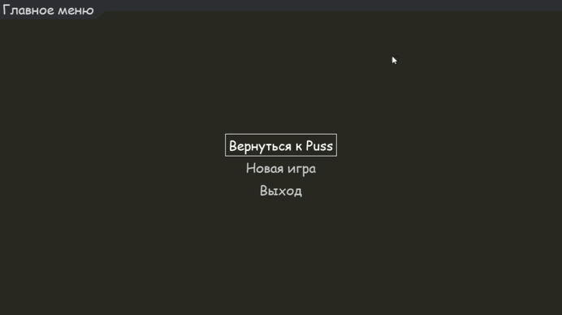

# Tamagochi Puss The Game

## Описание

Это простая игра тамагочи, в котором необходимо следить за показателями Кота.

## Технологии

Список технологий, которые использовались для разработки:

-   Язык программирования Python
-   библиотека Pygame и Pygame-menu

## Установка и запуск

Пошаговая инструкция для установки и запуска проекта на локальной машине:

1. Клонируйте репозиторий:

    ```bash
    git clone https://github.com/wyddy7/Tamagochi
    ```

2. Перейдите в директорию проекта:

    ```bash
    cd Tamagochi
    ```

3. Установите зависимости (например, для Python):

    ```bash
     pip install pygame
     pip install pygame-menu
    ```

4. Запустите проект:
    ```bash
    python main.py
    ```

## Что делать в игре вообще?

Сама по себе игра простенькая, тут несколько показателей, за которыми надо следить. В игре есть звуки и приятно гладить кота.

## Демонстрация геймплея



## Особенности

-   Плавное снижение показателей
-   Сохранение показателей при выходе из игры
-   Возможность начать новую игру
-   Реализована анимация руки при поглаживании и других смен состояний вроде лампы, кнопки настроек, состояние кота.
-   Отражение состояния кота в зависимости от его голода (процесс похудения)

## Планы на будущее

Пространство для развитие достаточно большое:

1. Можно реализовать смену локаций.
2. Можно сделать большее количество интеракций с котом, например, возможность поиграть с котом путем какой-нибудь игрушки, мыть кота при необходимости или же убирать за ним.
3. Можно реализовать кастомизацию кота.
4. Проработать спрайты кота на разные вариации.

##

-   GitHub: [ссылка на профиль](https://github.com/wyddy7)
